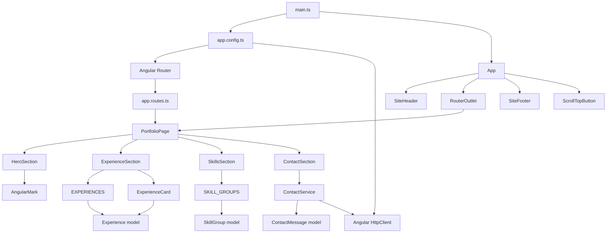

# Portfolio architecture

Status: current implementation baseline, updated 2026-08-15.

This document describes the architecture that exists in the repository now. Planned changes are
tracked separately in [`portfolio-future-work.md`](./portfolio-future-work.md).

## Current scope

The application is an Angular 22 standalone portfolio with one routed page. It currently includes:

- a site-wide header and footer;
- hero, experience, skills, and contact sections;
- typed static content for repeated experience and skill entities;
- a Formspree-backed contact form;
- an independent scroll-to-top feature;
- responsive plain CSS, reduced-motion handling, and accessible semantic markup;
- Vitest component tests and a production CSR build.

It does not currently include SSR, prerendering, theme switching, localization, Three.js, a CMS,
or end-to-end browser tests.

## Architectural approach

The project uses a small layered structure inspired by feature-oriented frontend architecture,
without adopting a framework-specific folder methodology in full.

| Layer       | Responsibility                                               | Current examples                          |
| ----------- | ------------------------------------------------------------ | ----------------------------------------- |
| Application | Bootstrap, global providers, routes, and the root site frame | `app.*`, `app.config.ts`, `app.routes.ts` |
| Layout      | Site-wide structural UI rendered around routed pages         | `site-header`, `site-footer`              |
| Pages       | Route entry points and page-level composition                | `portfolio-page`                          |
| Sections    | Cohesive content blocks owned by one page                    | `hero`, `experience`, `skills`, `contact` |
| Features    | Independent user behavior that is not page content           | `scroll-to-top`                           |

There is deliberately no `shared` directory. It should be introduced only when a genuinely
reusable, product-agnostic abstraction appears. Moving a component to `shared` only because it is
visually small would weaken ownership rather than improve reuse.

## Directory structure

```text
src/
|-- app/
|   |-- app.ts
|   |-- app.html
|   |-- app.css
|   |-- app.config.ts
|   |-- app.routes.ts
|   |-- layout/
|   |   |-- site-header/
|   |   `-- site-footer/
|   |-- features/
|   |   `-- scroll-to-top/
|   `-- pages/
|       `-- portfolio/
|           |-- portfolio-page.*
|           `-- sections/
|               |-- hero/
|               |   |-- hero-section.*
|               |   `-- angular-mark/
|               |-- experience/
|               |   |-- experience-section.*
|               |   |-- experience-card/
|               |   |-- data/
|               |   `-- models/
|               |-- skills/
|               |   |-- skills-section.*
|               |   |-- data/
|               |   `-- models/
|               `-- contact/
|                   |-- contact-section.*
|                   |-- data-access/
|                   `-- models/
|-- styles/
|   |-- tokens.css
|   |-- reset.css
|   |-- base.css
|   `-- utilities.css
`-- styles.css
```

Each component keeps its TypeScript, template, styles, and tests together. Data, models, and data
access are nested under the section that owns them instead of being collected in global utility
files.

## Runtime composition

```text
App
|-- SiteHeader
|-- RouterOutlet
|   `-- PortfolioPage
|       |-- HeroSection
|       |   `-- AngularMark
|       |-- ExperienceSection
|       |   `-- ExperienceCard x 3
|       |-- SkillsSection
|       `-- ContactSection
|           `-- ContactService
|-- SiteFooter
`-- ScrollTopButton
```

`App` is the site frame. `PortfolioPage` owns only the order of its sections; it does not own their
content or behavior. Each section owns the data and implementation details required to render its
part of the page.

## Dependency graph



### Dependency rules

- Dependencies flow inward from application composition to focused implementations.
- A page may import its sections, but a section must not import its page.
- One section must not reach into another section's internals.
- Section-local data, models, and services remain under that section until real reuse appears.
- Layout and feature components do not depend on page-specific components.
- Static data is imported directly; a service is not added merely to wrap constants.
- Cross-section state should be lifted to the page or a focused service only when coordination is
  actually required.

## Component responsibilities

- `App` renders the persistent site frame and the router outlet.
- `SiteHeader` renders global identity and primary navigation.
- `SiteFooter` renders footer content only.
- `ScrollTopButton` owns scroll observation, visibility state, reduced-motion behavior, and cleanup.
- `PortfolioPage` composes the four portfolio sections in document order.
- `HeroSection` owns profile introduction and calls to action.
- `AngularMark` is the stable boundary for the current static mark and a future 3D renderer.
- `ExperienceSection` owns the experience collection and renders it as a semantic list.
- `ExperienceCard` renders one typed `Experience` received through `input.required()`.
- `SkillsSection` owns and renders typed skill groups.
- `ContactSection` owns form state, validation, submission status, and user feedback.
- `ContactService` owns the Formspree HTTP contract and endpoint interaction.

## Data and state

Repeated static content is represented as typed, readonly TypeScript constants:

```text
ExperienceSection --> data/experiences.ts --> models/experience.model.ts
SkillsSection     --> data/skill-groups.ts --> models/skill-group.model.ts
```

This separates content from repeated markup, provides compile-time validation, supplies stable
tracking keys, and leaves a clear replacement point for a future API or CMS. Unique prose stays in
the section template when extracting it would add indirection without reuse.

Local interactive state uses Angular signals. The contact form uses typed Reactive Forms because
it has validation and submission behavior. No global store is needed: there is no shared mutable
application state.

## Providers, routing, and browser APIs

`app.config.ts` registers:

- global browser error listeners;
- `HttpClient` for contact delivery;
- Angular Router with anchor scrolling and scroll-position restoration.

The current route map is intentionally small:

```text
/     PortfolioPage
/**   redirect to /
```

The route owns the document title. Browser-dependent scroll behavior uses injected `DOCUMENT` and
runs in `afterNextRender`, which keeps direct `window` access out of component initialization and
provides a safer boundary for future server rendering.

## Angular conventions

- Standalone components; no application `NgModule` classes.
- Built-in template control flow (`@if`, `@for`) with stable tracking values.
- Signal inputs for required child-component data.
- `inject()` for dependency injection.
- Native semantic elements before ARIA-based emulation.
- `NgOptimizedImage` with intrinsic dimensions for static raster images.
- Native CSS motion rather than the legacy Angular animations package.
- Strict TypeScript and no `any` in application code.

## CSS architecture

Global styles are split by responsibility:

- `tokens.css` contains design tokens;
- `reset.css` normalizes browser defaults;
- `base.css` styles document-level elements and global accessibility states;
- `utilities.css` contains the small reusable `.page-width` and `.visually-hidden` utilities.

Component styles remain encapsulated with their components. The project uses plain CSS, native CSS
nesting, shallow selectors, Grid for two-dimensional layout, and Flexbox for one-dimensional
alignment. Design values are expressed through custom properties, `clamp()`, and responsive layout
rules. There is no Sass, Tailwind, CSS-in-JS, or global component class system.

Accessibility conventions include visible `:focus-visible` treatment, semantic landmarks and
headings, labelled navigation, meaningful image alternatives, and a global
`prefers-reduced-motion` fallback.

## Testing boundaries

- Page tests cover page composition and section order.
- Section tests cover section-owned content and behavior.
- Leaf-component tests cover their input contract and rendered details.
- HTTP behavior is tested with Angular's HTTP testing provider.
- Browser event behavior is tested with focused DOM event dispatch and spies where appropriate.
- Relevant Vitest tests and `npm run build` are required after behavioral changes.

## Evolution rules

New code should be placed at the narrowest correct ownership boundary:

1. Keep a detail inside its component while it has one owner.
2. Create a section-local model, data file, or service when that component needs separation.
3. Lift behavior to `features` only when it represents an independent user capability.
4. Lift structure to `layout` only when it belongs around routed content.
5. Introduce `shared` only after at least two consumers need the same stable abstraction.

This keeps the current project easy to navigate while allowing SSR, localization, themes, and a
3D Angular mark to be added without reorganizing unrelated sections.
